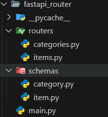

## 7-2-1 リファクタリングの主な目的

<figure markdown="span">
  {width=400}
  <figconfig>リファクタリングの目的のマインドマップ</figconfig>
</figure>

## 7-2-2 プログラムの作成(リファクタリング)

7.1で作成したプログラムを「APIRouter」を使用したものにリファクタリングする  
イメージとしては7.1のmain.pyで作成したプログラムをモジュール化する感じ

<div style="display: grid; grid-template-columns: 2.5fr 6.5fr; gap: 1rem; align-items: start;" markdown>
<div class="grid-item" markdown>
<figure markdown="span">
{width=200}
<figcaption>ファイル構成</figcaption>
</figure></div>

<div class="grid-item" markdown>
| フォルダ名 | 役割と説明 |
|------------|------------|
|routers| 各種APIエンドポイントをグループ化して管理するフォルダ       |
|schemas| リクエストとレスポンスのデータ構造を定義するための<br>モデルを管理するフォルダ       |
</div>
</div>

<figure markdown="span">
  {width=800}
  <figconfig>プログラムの関係性</figconfig>
</figure>

### shcemasフォルダ

リクエストとレスポンスデータ構造を定義

```python title="schemas/category.py"
from pydantic import BaseModel

class Category(BaseModel):
    category_id: int
    category_name: str
```

```python title="schemas/item.py"
from pydantic import BaseModel

class Item(BaseModel):
    item_id: int
    item_name: str
    category_id: int
```

### routersフォルダ

各種エンドポイントを定義

```python title="routes/categories.py　カテゴリーのエンドポイント"
from fastapi import APIRouter
from schemas.category import Category

router = APIRouter()

@router.get("/categories/", response_model=dict)
async def read_categories():
    return {"message": "カテゴリ一覧を表示", "categories":[]}

@router.post("/categories/{category_id}", response_model=dict)
async def create_category(category: Category):
    return {"message": "カテゴリを作成しました", "category": category}

@router.put("/categories/{category_id}", response_model=dict)
async def update_category(category_id: int, category: Category):
    return {"message": "カテゴリを更新しました",
            "category_id": category_id, "category": category}

@router.delete("/categories/{category_id}", response_model=dict)
async def delete_category(category_id: int):
    return {"message": "カテゴリを削除しました", "category_id": category_id}
```

```python title="routers/items.py　商品のエンドポイント"
from fastapi import APIRouter
from schemas.item import Item

router = APIRouter()

@router.get("/items/", response_model=dict)
async def read_items():
    return {"message": "商品一覧を表示", "items": []}

@router.post("/items/", response_model=dict)
async def create_item(item: Item):
    return {"message": "商品を作成しました", "item": item}

@router.put("/items/{item_id}", response_model=dict)
async def update_item(item_id: int, item: Item):
    return {"message": "商品を更新しました",
            "item_id": item_id, "item": item}

@router.delete("/items/{item_id}", response_model=dict)
async def delete_item(item_id: int):
    return {"message": "商品を削除しました", "item_id": item_id}
```

### main

```python title="main.py"
from fastapi import FastAPI
from routers.categories import router as category_router
from routers.items import router as item_router

app = FastAPI()

app.include_router(category_router) # include_routerでカテゴリ用ルーターをアプリケーションに追加
app.include_router(item_router)     # include_routerで商品用ルーターをアプリケーションに追加
```

これでSwagger UIで確認すると7.1同様の画面が確認できる

<br>

## 7-2-3 FastAPIクラスとAPIRouterクラスの比較

| 特徴                             | FastAPI クラスでのルーティング                        | APIRouter クラスでのルーティング                     |
|----------------------------------|------------------------------------------------------|----------------------------------------------------|
| 向いている開発規模  | 小規模アプリ、シンプルなAPI                        | 大規模アプリや整理された構造のAPI開発                |
| ルーティングの管理方法           |一箇所              | 複数モジュールに分割                       |
| 主な利点                         | シンプルで迅速な開発が可能                         | 機能別モジュールでの柔軟性と拡張性           |
| モジュールの組み込み方法         | 該当なし                                              | include_router()でモジュールを読み込む              |
