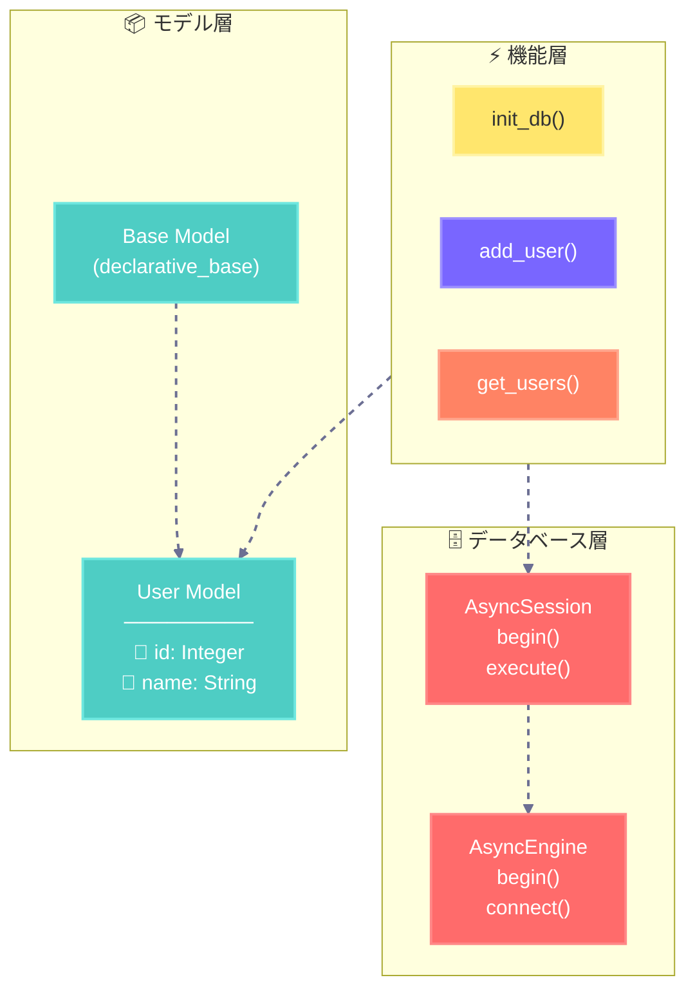

## 8-2-1 プロジェクトの作成
実際にSQLAlchemyを使用したプログラムを作成する

### コードの作成

```python title="main.py"
import os
import asyncio
from sqlalchemy.ext.asyncio import create_async_engine, AsyncSession
from sqlalchemy.ext.declarative import declarative_base
from sqlalchemy.orm import sessionmaker
from sqlalchemy import Column, Integer, String, select

# ベースクラスの定義
Base = declarative_base()

# データベース設定
base_dir = os.path.dirname(__file__)
DATABASE_URL = 'sqlite+aiosqlite:///' + os.path.join(base_dir, 'example.sqlite')

#==============データベース層==============
# 非同期エンジンを作成
engine = create_async_engine(DATABASE_URL, echo=True)

# 非同期セッションの作成
async_session = sessionmaker(
    engine,
    expire_on_commit=False,
    class_=AsyncSession
)


#==============モデル層==============
# ユーザーモデルの定義
class User(Base):
    __tablename__ = 'users'
    id = Column(Integer, primary_key=True, autoincrement=True)
    name = Column(String)


#==============機能層==============
# データベース初期化関数
async def init_db():
    print("データベースの初期化を開始します。")
    async with engine.begin() as conn:
        await conn.run_sync(Base.metadata.drop_all)
        print("既存のテーブルを削除しました。")
        await conn.run_sync(Base.metadata.create_all)
        print("新しいテーブルを作成しました。")

# ユーザー追加関数
async def add_user(name):
    print(f"{name}をデータベースに追加します。")
    async with async_session() as session:
        async with session.begin():
            user = User(name=name)
            session.add(user)
            print(f"{name}をデータベースに追加しました。")

# ユーザー取得関数
async def get_users():
    print("データベースからユーザーを取得します。")
    async with async_session() as session:
        result = await session.execute(select(User))
        users = result.scalars().all()
        print("ユーザーの取得が完了しました。")
        return users


#==============メイン処理==============
async def main():
    await init_db()
    await add_user("田中")
    await add_user("鈴木")
    users = await get_users()
    for user in users:
        print(f"{user.id}: {user.name}")

asyncio.run(main())
```

### コードの構造



### コードの解説

<div class="chat-container">
  <!-- ずんだもんの質問 -->
  <div class="chat right">
    <div class="chat-message zundamon-message">
      SQLAlchemyの非同期処理って難しそうなのだ...<br>
      何をやってるのかわからないのだ...
    </div>
    
  </div>

  <!-- 春日部つむぎの回答 -->
  <div class="chat left">
    
    <div class="chat-message tsumugi-message">
      あ～、確かにちょっとややこしいよね💦<br>
      まずは大きく3つの層に分かれてるんだ！<br>
      1. データベース層：データベースとの通信を管理<br>
      2. モデル層：データの形を定義<br>
      3. 機能層：実際の操作を行う<br>
      これを順番に見ていこうか！✨
    </div>
  </div>

  <div class="chat right">
    <div class="chat-message zundamon-message">
      データベース層ってなんなのだ？🤔
    </div>
    
  </div>

  <div class="chat left">
    
    <div class="chat-message tsumugi-message">
      えへへ、データベースとお話するための準備をする部分なの！
      <pre><code>engine = create_async_engine(DATABASE_URL, echo=True)
async_session = sessionmaker(
    engine,
    expire_on_commit=False,
    class_=AsyncSession
)</code></pre>
      ここでは2つの大切なものを作ってるの：<br>
      1. engine：データベースへの通信路を作るよ！<br>
      2. async_session：実際にデータをやり取りする窓口なの！<br>
      非同期処理だから、他の作業をしながらデータベースとお話できるんだ！
    </div>
  </div>

  <div class="chat right">
    <div class="chat-message zundamon-message">
      モデル層はどんなことをするのだ？📦<br>
      なんでクラスを使うのだ？
    </div>
    
  </div>

  <div class="chat left">
    
    <div class="chat-message tsumugi-message">
      モデル層は、データの設計図みたいなものなの！
      <pre><code>class User(Base):
    __tablename__ = 'users'
    id = Column(Integer, primary_key=True)
    name = Column(String)</code></pre>
      クラスを使う理由は3つあるんだよ：<br>
      1. データの形を分かりやすく定義できる<br>
      2. データベースのテーブルと簡単に対応づけられる<br>
      3. Pythonらしい書き方ができる！<br><br>
      
      例えば、ユーザーさんの場合：<br>
      - テーブル名は'users'<br>
      - idは自動で増える番号<br>
      - nameは文字列で保存<br>
      って感じで決められるんだ！✨
    </div>
  </div>
<div class="chat-container">
  <!-- ずんだもんの質問 -->
  <div class="chat right">
    <div class="chat-message zundamon-message">
      機能層では何をするのだ？🤔<br>
      asyncとawaitがいっぱい出てくるのだ！
    </div>
    
  </div>

  <!-- 春日部つむぎの回答 -->
  <div class="chat left">
    
    <div class="chat-message tsumugi-message">
      機能層が一番楽しいところなの！実際にデータベースを使う部分だよ！<br><br>
      
      3つの大切な関数があるの：
      <pre><code>async def init_db():
    async with engine.begin() as conn:
        await conn.run_sync(Base.metadata.create_all)

async def add_user(name):
    async with async_session() as session:
        async with session.begin():
            session.add(User(name=name))

async def get_users():
    async with async_session() as session:
        result = await session.execute(select(User))
        return result.scalars().all()</code></pre>

      asyncとawaitは非同期処理の魔法なの！✨<br>
      例えば、こんな感じで便利なの：<br>
      - データベースが処理してる間に他の作業ができる<br>
      - たくさんのユーザーが同時にアクセスしても大丈夫<br>
      - プログラムが止まらずにスムーズに動く<br>
    </div>
  </div>

  <!-- ずんだもんの質問 -->
  <div class="chat right">
    <div class="chat-message zundamon-message">
      機能層のところをもっと詳しく教えてほしいのだ！<br>
      それぞれの関数が何をしているのか分からないのだ...🤔
    </div>
    
  </div>

  <!-- 春日部つむぎの回答 -->
  <div class="chat left">
    
    <div class="chat-message tsumugi-message">
      うんうん！機能層の関数を1つずつ詳しく説明するね！✨
    </div>
  </div>

  <!-- 春日部つむぎの回答: init_db関数 -->
  <div class="chat left">
    
    <div class="chat-message tsumugi-message">
      まず、データベースを初期化する関数を見てみよう！
      <pre><code>async def init_db():
    print("データベースの初期化を開始します")
    async with engine.begin() as conn:
        # 既存のテーブルを削除
        await conn.run_sync(Base.metadata.drop_all)
        print("既存のテーブルを削除しました")
        
        # 新しいテーブルを作成
        await conn.run_sync(Base.metadata.create_all)
        print("新しいテーブルを作成しました")
</code></pre>

       この関数では3つの大切なことをしてるの：<br>
       1. engineを使ってデータベースに接続<br>
       2. 古いテーブルを安全に削除<br>
       3. 新しい空のテーブルを作成<br><br>
      
       async withを使うことで、接続の開始と終了を自動で管理できるんだ！
    </div>
  </div>

  <!-- ずんだもんの質問 -->
  <div class="chat right">
    <div class="chat-message zundamon-message">
      ユーザーを追加する関数はどうなってるのだ？🤔
    </div>
    
  </div>

  <!-- 春日部つむぎの回答 -->
  <div class="chat left">
    
    <div class="chat-message tsumugi-message">
      ユーザーを追加する関数はこんな感じだよ！
      <pre><code>async def add_user(name):
    print(f"{name}をデータベースに追加します")
    async with async_session() as session:
        async with session.begin():
            # 新しいユーザーオブジェクトを作成
            user = User(name=name)
            # セッションに追加
            session.add(user)
            print(f"{name}をデータベースに追加しました")
</code></pre>

      この関数でやってることは：<br>
      1. セッションを開始（データベースとの会話を始める）<br>
      2. トランザクションを開始（変更を安全に行うための仕組み）<br>
      3. Userクラスで新しいユーザーを作成<br>
      4. データベースに保存<br><br>

      二重の`async with`を使うことで：<br>
      - エラーが起きても安全<br>
      - 自動でコミットしてくれる<br>
      - セッションも自動で閉じてくれる<br>
      すごく便利なんだ！✨
    </div>
  </div>

  <!-- ずんだもんの質問 -->
  <div class="chat right">
    <div class="chat-message zundamon-message">
      ユーザーを取得する関数についても詳しく知りたいのだ！
    </div>
    
  </div>

  <!-- 春日部つむぎの回答 -->
  <div class="chat left">
    
    <div class="chat-message tsumugi-message">
      うん！ユーザーを取得する関数を見てみよう！
      <pre><code>async def get_users():
    print("データベースからユーザーを取得します")
    async with async_session() as session:
        # SQLAlchemyのSELECT文を作成
        stmt = select(User)
        # クエリを実行
        result = await session.execute(stmt)
        # 結果を取得
        users = result.scalars().all()
        print("ユーザーの取得が完了しました")
        return users
</code></pre>

      この関数では：<br>
      1. `select(User)`でSQLのSELECT文を作成<br>
      2. `session.execute()`でクエリを実行<br>
      3. `scalars().all()`で結果をPythonのリストに変換<br><br>

      ここでのポイントは：<br>
      - SQLを直接書かなくても大丈夫！<br>
      - 結果は普通のPythonオブジェクトとして扱える<br>
      - async/awaitのおかげで非同期処理ができる<br>
      
      だから、こんな感じで簡単に使えるの：
      <pre><code>users = await get_users()
for user in users:
    print(f"ID: {user.id}, Name: {user.name}")
</code></pre>
    </div>
  </div>

  <!-- ずんだもんの質問 -->
  <div class="chat right">
    <div class="chat-message zundamon-message">
      全部まとめるとどうなるのだ？🌟
    </div>
    
  </div>

  <!-- 春日部つむぎの回答 -->
  <div class="chat left">
    
    <div class="chat-message tsumugi-message">
      えへへ、全部まとめるとこんな感じになるの！
      <pre><code>async def main():
    # データベースの準備
    await init_db()  # テーブルを作るよ！

    # ユーザーさんを追加
    await add_user("田中")  # 田中さん、いらっしゃい！
    await add_user("鈴木")  # 鈴木さんも、どうぞ！

    # 登録された人を確認
    users = await get_users()
    for user in users:
        print(f"{user.id}: {user.name}")
</code></pre>

      このプログラムの特徴は：<br>
      1. データベースの準備から使用まで全部非同期<br>
      2. コードがとってもスッキリしてる<br>
      3. エラーが起きても安全に処理できる<br><br>

      非同期処理のおかげで、とってもスムーズに動くんだ！✨<br>
      何か分からないことがあったら、また聞いてね！えへへ😊
    </div>
  </div>
</div>
</div>

## 8-2-2 動作確認の実施

実行すると下記のように、データの初期化が行われ、データが追加され、  
一覧を取得処理がターミナル上で確認できある。  
また、SQLiteデータベースファイルが作成される。

```bash title="出力結果"
2024-11-21 15:51:13,574 INFO sqlalchemy.engine.Engine [no key 0.00009s] ()
新しいテーブルを作成しました。
2024-11-21 15:51:13,581 INFO sqlalchemy.engine.Engine COMMIT
田中をデータベースに追加します。
田中をデータベースに追加しました。
2024-11-21 15:51:13,583 INFO sqlalchemy.engine.Engine BEGIN (implicit)
2024-11-21 15:51:13,584 INFO sqlalchemy.engine.Engine INSERT INTO users (name) VALUES (?)
2024-11-21 15:51:13,584 INFO sqlalchemy.engine.Engine [generated in 0.00013s] ('田中',)
2024-11-21 15:51:13,585 INFO sqlalchemy.engine.Engine COMMIT
鈴木をデータベースに追加します。
鈴木をデータベースに追加しました。
2024-11-21 15:51:13,593 INFO sqlalchemy.engine.Engine BEGIN (implicit)
2024-11-21 15:51:13,593 INFO sqlalchemy.engine.Engine INSERT INTO users (name) VALUES (?)
2024-11-21 15:51:13,593 INFO sqlalchemy.engine.Engine [cached since 0.009258s ago] ('鈴木',)
2024-11-21 15:51:13,594 INFO sqlalchemy.engine.Engine COMMIT
データベースからユーザーを取得します。
2024-11-21 15:51:13,601 INFO sqlalchemy.engine.Engine BEGIN (implicit)
2024-11-21 15:51:13,602 INFO sqlalchemy.engine.Engine SELECT users.id, users.name 
FROM users
2024-11-21 15:51:13,603 INFO sqlalchemy.engine.Engine [generated in 0.00016s] ()
ユーザーの取得が完了しました。
2024-11-21 15:51:13,604 INFO sqlalchemy.engine.Engine ROLLBACK
1: 田中
2: 鈴木
```